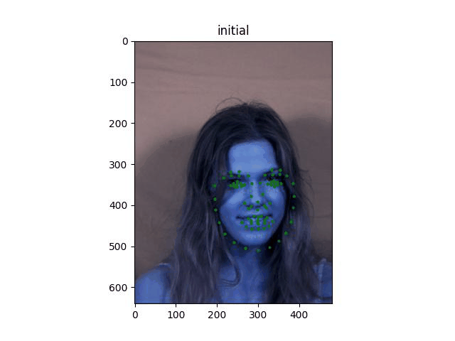

# ASM
Term Project for FUDAN DATA630015 医学影像处理

## DATA
Full data can bu found at https://www.todesk.com/linux.html. Here only 228 pictures are used to train. The data processing code `data_processer.m` are from https://github.com/johnwmillr/ActiveShapeModels

## codes
All main codes are in folder `src`. The jupyter file `example.ipynb` gives an example for using these codes.

## results
The results in `example.ipynb` is shown below:

